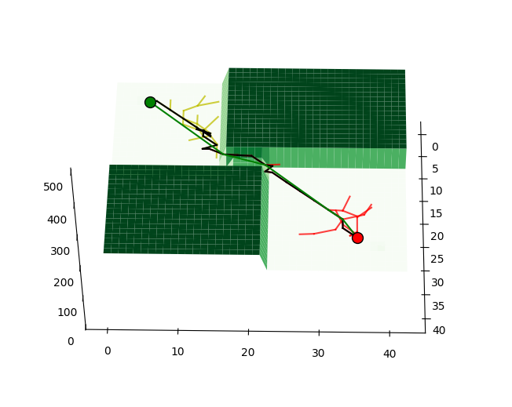
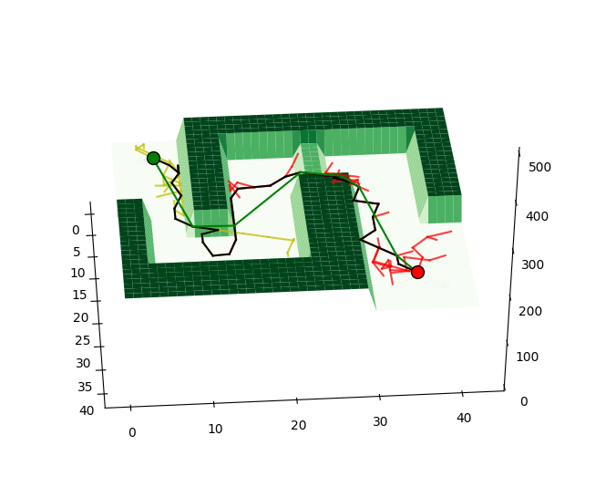

# PLAN 

## how to run?

```shell
bash run.sh
```

This command will create environment that needed by this plan project.
Then call python rrt_main.py

## map1
   map size 40 * 40
   start point 5,5, 160
   end point 35, 35, 180
   there are no obstacles

output
```shell
rrt_main.py line:44 start point:[  5.   5. 160.]
rrt_main.py line:46 goal point:[ 35.  35. 180.]
rrt_plan.py line:113 [(5.0, 5.0, 160.0), (21, 20, 172), (35, 29, 176), (35.0, 35.0, 180.0)]
rrt_main.py line:47 iter:28
rrt_main.py line:48 time used = 0.015375614166259766 s
```

  
  
  
  

## map2
   map size 40 * 40
   start point 5,5, 160
   end point 35, 35, 180
   there are no obstacles

output
```shell
rrt_main.py line:44 start point:[  5.   5. 160.]
rrt_main.py line:46 goal point:[ 35.  35. 180.]
rrt_plan.py line:113 [(5.0, 5.0, 160.0), (18, 15, 173), (21, 23, 174), (29, 31, 176), (31, 33, 177), (35.0, 35.0, 180.0)]
rrt_main.py line:47 iter:57
rrt_main.py line:48 time used = 0.020947694778442383 s
```

  
  
  
  

## map3
   map size 40 * 40
   start point 5,5, 160
   end point 35, 35, 180
   there are no obstacles

output
```shell
rrt_main.py line:44 start point:[  5.   5. 160.]
rrt_main.py line:46 goal point:[ 35.  35. 180.]
rrt_plan.py line:113 [(5.0, 5.0, 160.0), (18, 12, 179), (23, 34, 180), (35.0, 35.0, 180.0)]
rrt_main.py line:47 iter:60
rrt_main.py line:48 time used = 0.0247650146484375 s
```

  
  
  
  

## map4
   map size 40 * 40
   start point 5,5, 160
   end point 35, 35, 180
   there are no obstacles

output
```shell
rrt_main.py line:44 start point:[  5.   5. 160.]
rrt_main.py line:46 goal point:[ 35.  35. 180.]
rrt_plan.py line:113 [(5.0, 5.0, 160.0), (18, 9, 191), (20, 27, 177), (23, 31, 173), (31, 33, 176), (35.0, 35.0, 180.0)]
rrt_main.py line:47 iter:140
rrt_main.py line:48 time used = 0.04853963851928711 s
```

  
  
  
  

## map5
   map size 40 * 40
   start point 5,5, 160
   end point 35, 35, 180
   there are no obstacles

output
```shell
rrt_main.py line:44 start point:[  5.   5. 160.]
rrt_main.py line:46 goal point:[ 35.  35. 180.]
rrt_plan.py line:113 [(5.0, 5.0, 160.0), (18, 9, 186), (20, 29, 170), (31, 34, 177), (35.0, 35.0, 180.0)]
rrt_main.py line:47 iter:80
rrt_main.py line:48 time used = 0.03031611442565918 s
```

  
  
  
  

## map6
   map size 40 * 40
   start point 5,5, 160
   end point 35, 35, 180
   there are no obstacles

output
```shell
```

  
  
  
  
## map7
   map size 40 * 40
   start point 5,5, 160
   end point 35, 35, 180
   there are no obstacles

output
```shell
rrt_main.py line:44 start point:[  5.   5. 160.]
rrt_main.py line:46 goal point:[ 35.  35. 180.]
rrt_plan.py line:113 [(5.0, 5.0, 160.0), (24, 8, 168), (22, 14, 167), (12, 23, 181), (13, 30, 178), (34, 33, 176), (35.0, 35.0, 180.0)]
rrt_main.py line:47 iter:135
rrt_main.py line:48 time used = 0.04332327842712402 s
```

  
  
  
  

## map_obstacle
   map size 40 * 40
   start point 5,5, 160
   end point 35, 35, 180
   there are obstacles

output
```shell
rrt_main.py line:44 start point:[  5.   5. 160.]
rrt_main.py line:46 goal point:[ 35.  35. 180.]
rrt_plan.py line:113 [(5.0, 5.0, 160.0), (18, 16, 184), (20, 22, 181), (29, 31, 175), (31, 33, 176), (35.0, 35.0, 180.0)]
rrt_main.py line:47 iter:54
rrt_main.py line:48 time used = 0.026658296585083008 s
```

  
  
  
  

## map_obstacles2
   map size 40 * 40
   start point 5,5, 160
   end point 35, 35, 180
   there are obstacles

output
```shell
rrt_main.py line:44 start point:[  5.   5. 160.]
rrt_main.py line:46 goal point:[ 35.  35. 180.]
rrt_plan.py line:113 [(5.0, 5.0, 160.0), (22, 9, 169), (23, 14, 177), (12, 23, 182), (13, 28, 180), (15, 30, 173), (31, 33, 177), (35.0, 35.0, 180.0)]
rrt_main.py line:47 iter:196
rrt_main.py line:48 time used = 0.06139707565307617 s
```

  
  
  
  

## map_obstacles3
   map size 40 * 40
   start point 5,5, 160
   end point 35, 35, 180
   there are obstacles

output
```shell
rrt_main.py line:44 start point:[  5.   5. 160.]
rrt_main.py line:46 goal point:[ 35.  35. 180.]
rrt_plan.py line:113 [(5.0, 5.0, 160.0), (20, 8, 187), (22, 10, 187), (22, 15, 189), (13, 21, 181), (13, 30, 182), (34, 37, 182), (35.0, 35.0, 180.0)]
rrt_main.py line:47 iter:296
rrt_main.py line:48 time used = 0.08981966972351074 s
```

  
  
  
  
